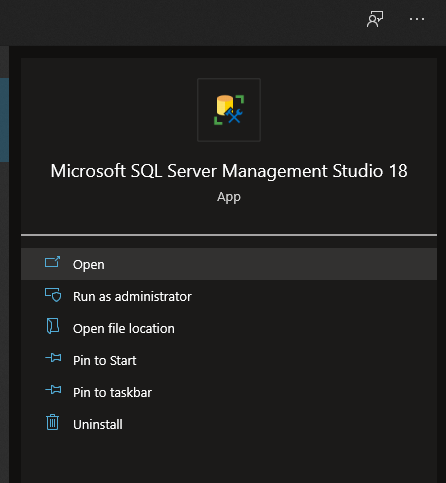

# Creando la base de datos con Microsoft SQL Server Management Studio

Para crear la base de datos que utilizaremos en nuestra aplicación podemos utilizar dos herramientas, 
una de ellas es **Microsoft SQL Server Management Studio** y la otra es la ventana **Server Explorer de 
Visual Studio.**

Empecemos con SQL Server Management Studio.

1. Abre la aplicación **Microsoft SQL Server Management Studio.**

     
     

2. En la ventana **Connect to Server** selecciona **Database Engine** como tipo de servidor.
3. Introduce o selecciona el nombre del servidor SQL Server.
4. Selecciona **Windows Authentication** como el tipo de autenticación. Sí lo prefieres puedes 
seleccionar otro tipo de autenticación y proporcionar los datos de autenticación que te sean 
solicitados.
5. Haz clic en el botón **Connect** para realizar la conexión.

Después de realizar la conexión te será mostrada la ventana **Object Explorer.**

6. Desde la ventana **Object Explorer** selecciona la opción **New Database** del menú contextual del 
   nodo **Databases.**
   
   
   
   7. En la ventana **New Database** establece el nombre **NWind** a la base de datos y haz clic en el 
      botón **OK** para crear la nueva base de datos.
      
      
      
   8. En la ventana **Object Explorer**, selecciona la opción **New > Table…** del menú contextual del 
      nodo **Tables.**
      
      
      
  9. En la ventana de diseño de la tabla, registra la siguiente información

     
     
  10. Selecciona la opción **Set primary Key** del menú contextual del campo CategoryID para 
      establecer el campo CategoryID como la llave primaria de la tabla.
      
      
      
   11. En la sección **Column Properties** del campo *CategoryID* establece la propiedad **Is Identity** con 
       el valor **Yes.**
       
       
       
   12. Guarda la tabla con el nombre **Categories.**

Después de guardar los cambios, podrás ver la tabla **Categories** dentro de la carpeta **Tables**
de la Base de Datos **NWind.**

Realice el mismo procedimiento para crear otra tabla llamada **Products**:

Escribe los nombres de las columnas, tipos de datos y opciones Null de acuerdo con la siguiente 
tabla:

Al finalizar estas tareas vamos a tener la base de datos con las siguientes tablas:

       

     

