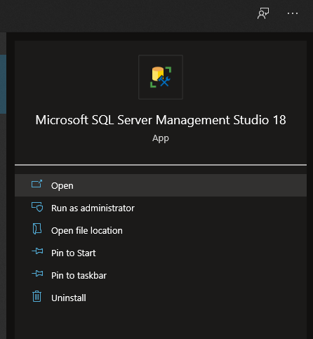

# Creando la base de datos con Microsoft SQL Server Management Studio

Para crear la base de datos que utilizaremos en nuestra aplicación podemos utilizar dos herramientas, 
una de ellas es **Microsoft SQL Server Management Studio** y la otra es la ventana **Server Explorer de 
Visual Studio.**

Empecemos con SQL Server Management Studio.

1. Abre la aplicación **Microsoft SQL Server Management Studio.**

